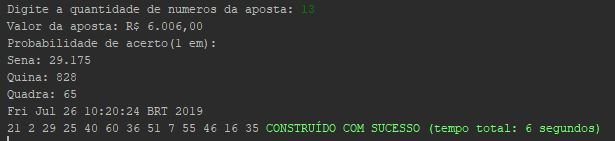

# MackS1Loteria

  
	

Esse é um projeto destinado a disciplina de Laboratório de Programação do curso de Sistemas de Informação realizada no segundo semestre de 2015 e consiste basicamente em um programa que solicita ao usuário o número de uma aposta de loteria e apresenta o valor da aposta, a probabilidade de acerto conforme as modalidades e os números gerados aleatóriamente.

# Conteúdo do repositório

[**/documentacao/code/**](https://github.com/DarioTeles/MackS1Loteria/tree/master/code/) - Códigos do projeto para serem importados na IDE.

# Recursos

[**NetBeans IDE 8.2**](https://github.com/apache/netbeans) - Software de desenvolvimento.
