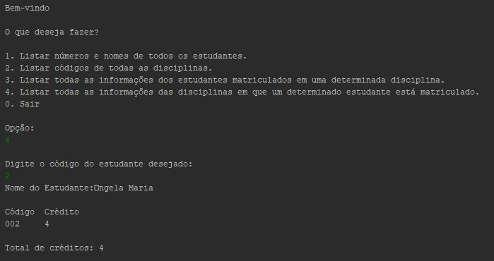

# MackS2GestaoAcademica

  
	

Esse é um projeto destinado a disciplina de Linguagem de Programação 1 do curso de Sistemas de Informação realizada no primeiro semestre de 2016 e consiste numa aplicação de gestão academica de universidade. Nele é realizado a leitura de dados em arquivos e possibilita o usuário realizar consultas.

# Conteúdo do repositório

[**/documentacao/code/**](code/) - Códigos do projeto para serem importados na IDE.

[**/documentacao/especificacao/**](especificacao/) - Especificações do projeto.

# Recursos

[**NetBeans IDE 8.2**](https://github.com/apache/netbeans) - Software de desenvolvimento.
