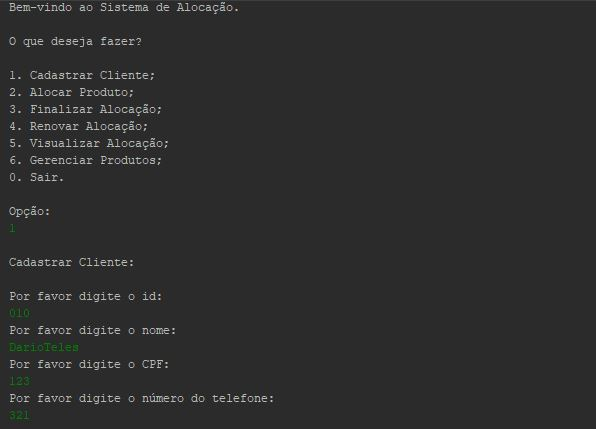
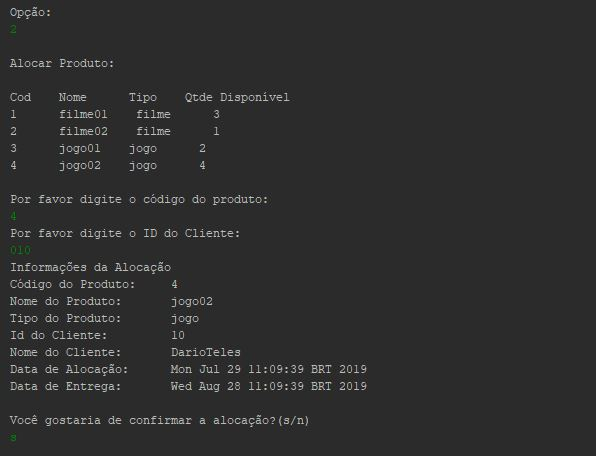

# MackS2Locadora

	

	

Esse é um projeto destinado a disciplina de Análise, Projeto e Desenvolvimento 1 do curso de Sistemas de Informação realizada no primeiro semestre de 2016 e consiste numa aplicação de alocação de filmes e jogos no qual é realizado o cadastro de produtos pelo administrador, o cadastro de clientes e a gestão de alocação de produtos.

# Conteúdo do repositório

[**/documentacao/code/**](code/) - Códigos do projeto para serem importados na IDE.

[**/documentacao/especificacao/**](especificacao/) - Especificações do projeto.

# Recursos

[**NetBeans IDE 8.2**](https://github.com/apache/netbeans) - Software de desenvolvimento.

[**WhiteStarUml**](https://github.com/StevenTCramer/WhiteStarUml) - Software de modelagem UML.
