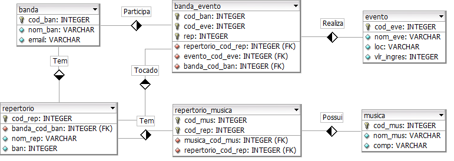

# MackS4FanBandBD

	

Esse é um projeto destinado às disciplinas de Banco de Dados 1 e 2 do curso de Sistemas de Informação realizadas no ano de 2017 e consiste na modelagem e na implantação de scripts SQL no SGBD Oracle Database:
<ul>
	<li>Criação do banco;</li>
	<li>Inserção de dados;</li>
	<li>Consultas;</li>
	<li>Procedures;</li>
	<li>Functions;</li>
	<li>Triggers.</li>
</ul>

# Conteúdo do repositório

[**/documentacao/modelagem/**](modelagem) - Documentação e modelagem do banco de dados.  
[**/documentacao/banco_de_dados_1/**](banco_de_dados_1) - Pré-requisistos e scripts da disciplina de Banco de Dados 1.  
[**/documentacao/banco_de_dados_2/**](banco_de_dados_2) - Pré-requisistos e scripts da disciplina de Banco de Dados 2.  
