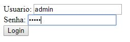
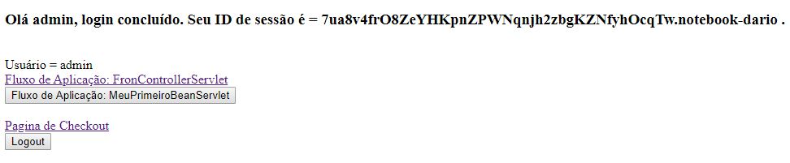
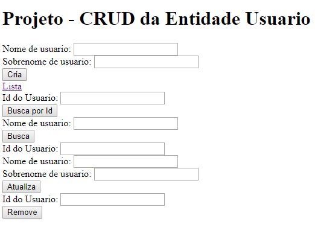
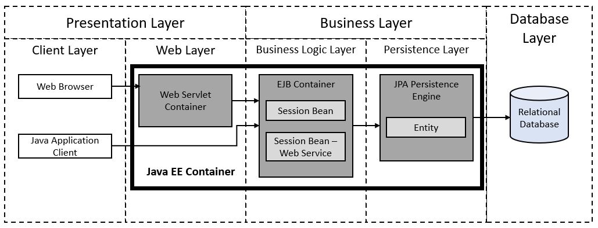

# MackS4Projeto2JavaEE

Esse é um projeto destinado a disciplina de Linguagem de Programação 3 do curso de Sistemas de Informação realizada no primeiro semestre de 2017. Esse projeto é continuação do projeto MackS4Projeto1JavaEE. Ele consiste numa aplicação baseada em componentes corporativos Java2EE e define exemplos de fluxos de aplicação que demonstram os usos de tais componentes:

# Login

Nesse fluxo foi utilizado os componentes corporativos Filter e Session, responsáveis pela lógica de autenticação e criação de sessão respectivamente.

	

	

# AppFrontController

Esse fluxo define o CRUD da entidade usuário e nele foi utilizado o componente comporativo JPA com Hibernate, responsável pelo MOR (Mapeamento Objeto Relacional); Data Source, Padrão Arquitetural MVC, Design Pattern Factory e especificação Servlet. As regras de negócio tanto do fluxo de login quanto do AppFrontController estão definidos no módulo EJB.

	

# Web Service Rest

Esse fluxo define o componente corporativo EJB para Web Service Rest responsável por disponibilizar a consulta de um determinado usuário pelo seu ID (XML ou JSON) e a inserção de um novo usuário. Para o consumo do serviço, foi desenvolvido um programa Java.

	

# Conteúdo do repositório

[**/documentacao/db/**](db/) - Backup da base de dados utilizado no desenvolvimento do projeto. 
[**/documentacao/code/**](code/) - Códigos do projeto para serem abertos na IDE Netbeans com o serviço Derby e Wildfly (JBoss) previamente instalados. 

# Recursos

[**NetBeans IDE 8.2**](https://github.com/apache/netbeans) - Software de Desenvolvimento. 
[**Apache Derby**](https://github.com/apache/derby) - Banco de Dados. 
[**Wildfly Application Server**](https://github.com/wildfly/wildfly) - Servidor de Aplicação.

# Pré-requisitos

Para realizar o deploy no Wildfly é necessário que ele esteja previamente instalado e configurado seguindo as seguintes instruções: 
<ol>
<li>Configurar o usuário administrador do Wildfly: comando add-user.bat (dario/javaee123!).</li>
<li>Iniciar o serviço: comando stadalone.bat -b 0.0.0.0 -c standalone-full.xml .</li> 
<li>Adicionar o módulo (driver) JDBC.</li>
<li>Registrar o módulo JDBC.</li>
<li>Adicionar o Data Source Derby (Pool de Conexão).</li>
<li>Testar o Data Source Derby.</li>
</ol>
 
É necessário que o servidor Derby esteja iniciado para executar a aplicação.
