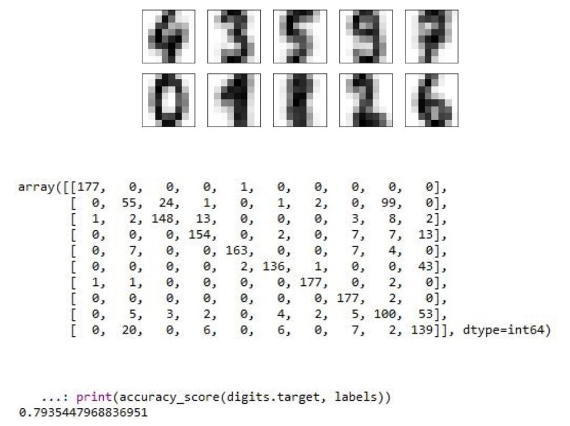
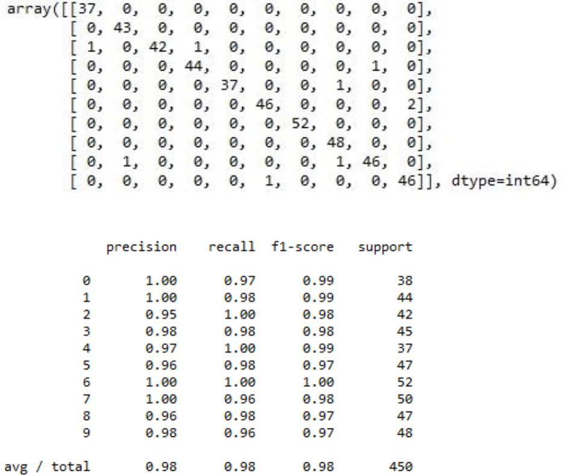

# MackS7ClassificacaoDigitos

Esse é um projeto destinado a disciplina de Inteligência Artificial do curso de Sistemas de Informação realizada no segundo semestre de 2017 e consiste numa análise de comparação entre dois algoritmos utilizados na classificação de dígitos utilizando a linguagem de programação Python.

# O Problema

O problema desse projeto é definido por uma base de imagens de dígitos escritos à mão, no qual deve-se aplicar o reconhecimento óptico desses caracteres. Esse conjunto de dígitos está incluso na biblioteca Scikit-Learn. Os dados das imagens são uma matriz tridimensional cada amostra consistindo em uma grade de 8 x 8 pixels.

# Proposta de Solução

Como propostas de solução, foi aplicado algoritmos de Machine Learning, em que após a aplicação foi obtido os resultados de desempenho de cada algoritmo:

<ol>
<dl>
<li>
	<b>K-means</b> – por se tratar de um algoritmo de agrupamento, ele desconsidera os rótulos de classificação e aplica o conceito de centro de grupos, que trata de médias aritméticas em que definem centros e vincula os pontos ao centro mais próximo deles. Segue abaixo a definição dos grupos, a matriz de confusão e a acurácia da aplicação no problema respectivamente:

	

</li>
<li>
	<b>Random Forest</b> – por sua vez é um algoritmo de classificação que utiliza a estrutura de árvores de decisão. Segue abaixo a matriz de confusão e o relatório de classificação da aplicação do algoritmo:

	

	
</li>
</dl>
</ol>

# Análise dos Resultados

Analisando as matrizes de confusão, percebesse que o algoritmo K-means teve mais
erros de identificação de dígitos em relação ao algoritmo Random Forest principalmente em dígitos visualmente semelhantes, por exemplo os dígitos 1 e 8. Isso é demonstrado também pela acurácia do algoritmo K-mens que resultou em 79,35% em comparação à média de precisão do algoritmo Random Forest que resultou em 98%. Com isso podemos concluir que Random Forest teve melhor desempenho em relação ao K-means possivelmente pelo fato de o algoritmo de agrupamento desconsiderar os rótulos de classificação.

# Conteúdo do repositório

[**/documentacao/code/**](code/) - Códigos do projeto para serem importados na IDE.

# Recursos

[**Spyder 3.3.1**](https://github.com/spyder-ide/spyder) - The Scientific Python Development Environment.
